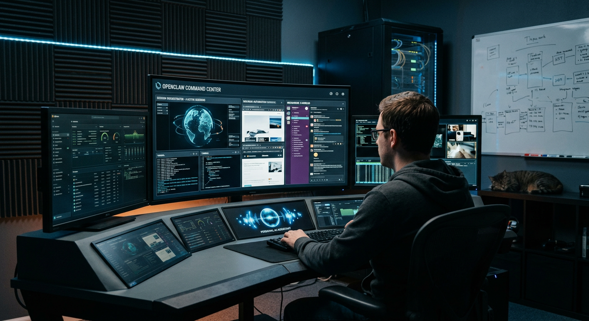
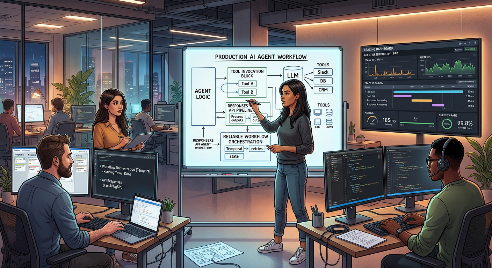

# Frontier Signal Digest — 2026-03-01

*Generated: 2026-03-01 18:04 EST*

## 1) OpenClaw: personal AI assistant runtime on user-owned devices
- **Publisher:** GitHub (OpenClaw)
- **URL:** https://github.com/openclaw/openclaw
- **Summary:** OpenClaw presents a practical agent runtime spanning messaging, browser automation, voice tools, and orchestration while remaining local-first and operator-controlled.
- **Why it matters:** This directly supports artifact-first credibility by enabling reproducible real-world automations.
- **Image:** 

## 2) OpenAI Agents guide: production patterns for tool-using agents
- **Publisher:** OpenAI Developers
- **URL:** https://developers.openai.com/api/docs/guides/agents
- **Summary:** The agents guide documents modular patterns for building, deploying, and optimizing tool-using agents with lower orchestration overhead.
- **Why it matters:** It provides a benchmark for reliability and observability decisions in your stack.
- **Image:** 

## 3) Anthropic MCP: interoperability standard for connected assistants
- **Publisher:** Anthropic
- **URL:** https://www.anthropic.com/news/model-context-protocol
- **Summary:** MCP defines a common protocol for connecting assistants to external tools and data systems, reducing bespoke integration complexity.
- **Why it matters:** Standardized connectivity improves long-term toolchain sustainability and speed of iteration.
- **Image:** 

---

## Operator Notes
- Run a 7-day bakeoff comparing OpenClaw-native orchestration vs hosted-agent orchestration on one workflow.
- Publish one artifact build log with reliability metrics.
- Add one MCP-compatible connector trial and measure setup + maintenance overhead.
