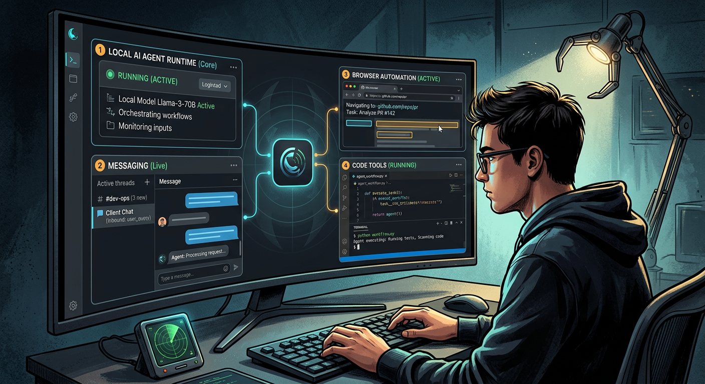
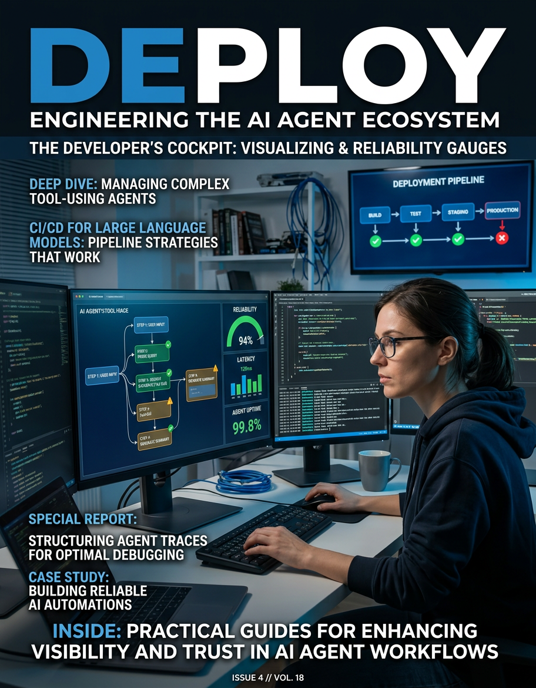
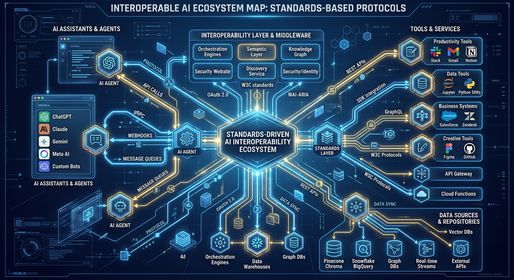

# Frontier Signal Digest — 2026-03-02

*Generated: 2026-03-02 07:08 EST*

## 1) OpenClaw: local-first agent runtime for practical automation
- **Publisher:** GitHub (OpenClaw)
- **URL:** https://github.com/openclaw/openclaw
- **Summary:** OpenClaw provides an operator-controlled runtime that combines messaging, browser control, node/device integrations, and sub-agent orchestration in one system. The project is open source and tuned for real-world workflows rather than demo-only agent loops.
- **Why it matters:** This is directly aligned with your credibility runway: you can ship visible artifacts fast while keeping control over stack behavior and costs.
- **Image:** 

## 2) OpenAI Agents guide: production patterns for tool-using systems
- **Publisher:** OpenAI Developers
- **URL:** https://developers.openai.com/api/docs/guides/agents
- **Summary:** The Agents guide lays out concrete implementation patterns for tool orchestration, instruction scaffolding, and evaluation loops. It frames how to move from single prompts to operational agent systems with measurable reliability.
- **Why it matters:** Use this as a benchmark to tighten your own build standards on observability, retries, and task decomposition.
- **Image:** 

## 3) Model Context Protocol (MCP): interoperability for AI agents
- **Publisher:** Anthropic
- **URL:** https://www.anthropic.com/news/model-context-protocol
- **Summary:** MCP defines a standard way for assistants to connect to external tools and data backends, reducing bespoke connector overhead. The protocol-level approach improves portability across model and platform choices.
- **Why it matters:** Protocol-first integrations reduce switching cost and increase toolchain sustainability as the frontier stack shifts.
- **Image:** 

---

## Operator Notes
- Build one repeatable workflow this week with OpenClaw + at least one MCP-style connector, then publish a short teardown.
- Add a tiny reliability scorecard (success rate, latency, operator interventions) to each shipped artifact.
- Prioritize one public artifact over additional research to compound visible execution.
