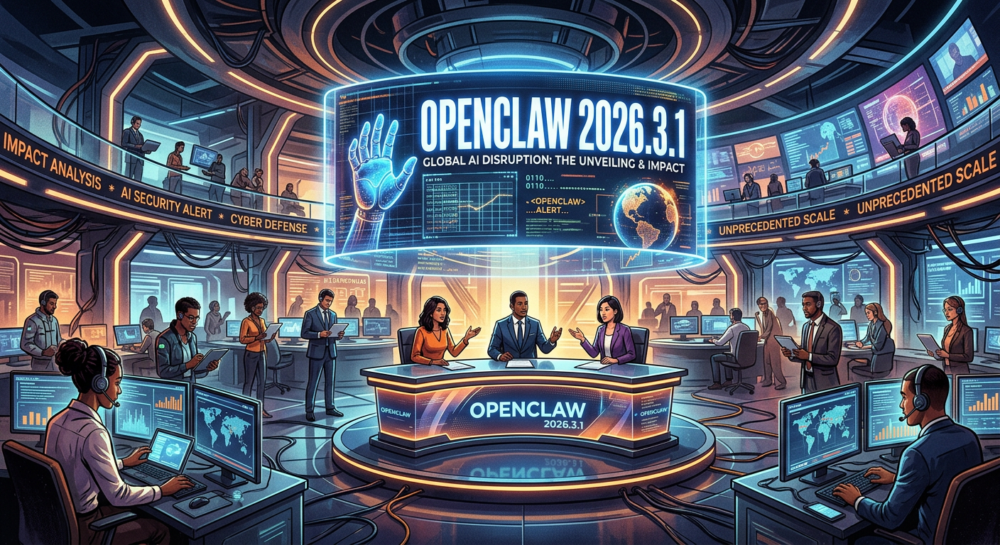
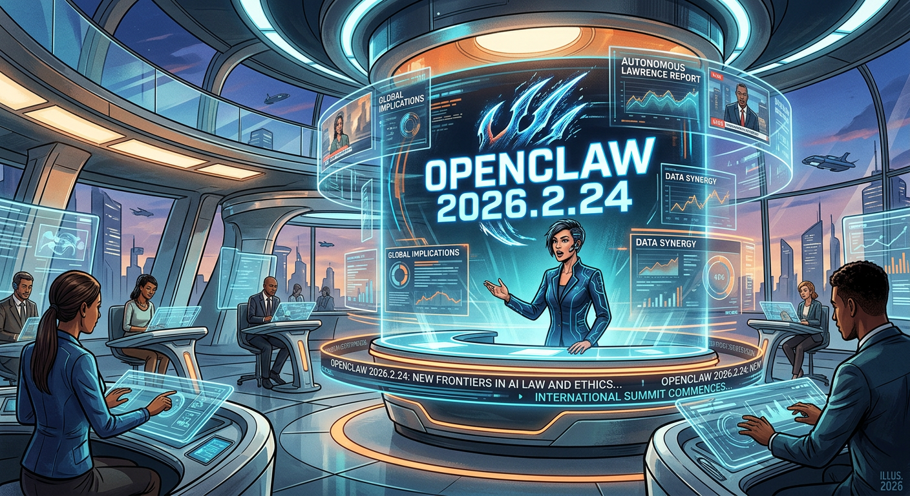
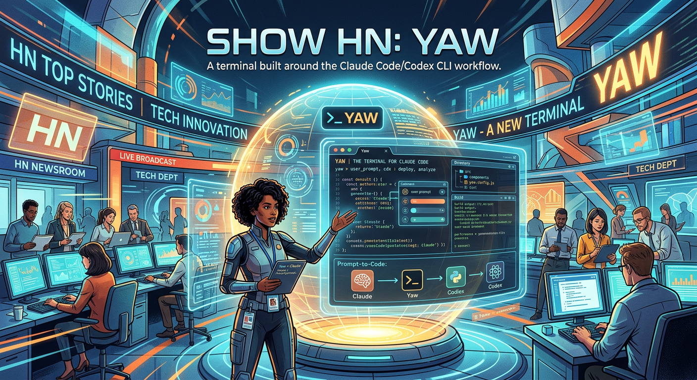

# Frontier Signal Digest — 2026-03-03

_Generated: 2026-03-03T10:15:34_

## Signal 1: openclaw 2026.3.1
- **Publisher:** OpenClaw Releases
- **URL:** https://github.com/openclaw/openclaw/releases/tag/v2026.3.1
- **Summary:** <h3>Changes</h3>
<ul>
<li>Agents/Thinking defaults: set <code>adaptive</code> as the default thinking level for Anthropic Claude 4.6 models (including Bedrock Claude 4.6 refs) while keeping other reasoning-capable models at <code>low</code> unless explicitly configured.</li>
<li>Gateway/Container probes: add built-in HTTP liveness/readiness endpoints (<code>/health</code>, <code>/healthz</code>, <code>/ready</code>, 
- **Why it matters:** This item signals near-term movement in AI tooling or agent workflows relevant to Christopher's build trajectory.
- **Image:** 

## Signal 2: openclaw 2026.2.24
- **Publisher:** OpenClaw Releases
- **URL:** https://github.com/openclaw/openclaw/releases/tag/v2026.2.24
- **Summary:** <h3>Changes</h3>
<ul>
<li>Auto-reply/Abort shortcuts: expand standalone stop phrases (<code>stop openclaw</code>, <code>stop action</code>, <code>stop run</code>, <code>stop agent</code>, <code>please stop</code>, and related variants), accept trailing punctuation (for example <code>STOP OPENCLAW!!!</code>), add multilingual stop keywords (including ES/FR/ZH/HI/AR/JP/DE/PT/RU forms), and treat exact <code>do not do t
- **Why it matters:** This item signals near-term movement in AI tooling or agent workflows relevant to Christopher's build trajectory.
- **Image:** 

## Signal 3: Show HN: Yaw – A terminal built around the Claude Code/Codex CLI workflow
- **Publisher:** Hacker News
- **URL:** https://yaw.sh
- **Summary:** I use Claude Code and Codex constantly, and my workflow was always the same: launch the agent, need a shell in the same directory, open a new tab, cd back. 
Fifty times a day.
So I built auto-snap into Yaw — launch any AI coding CLI and it detects it and splits the pane automatically. Agent on the left, fresh shell in the same directory on the right. Works with Claude Code, Codex, Gemini CLI, an
- **Why it matters:** This item signals near-term movement in AI tooling or agent workflows relevant to Christopher's build trajectory.
- **Image:** 

## Operator Notes
- Deterministic feed mode enabled (RSS/Atom/HN API), avoiding Brave web_search dependency.