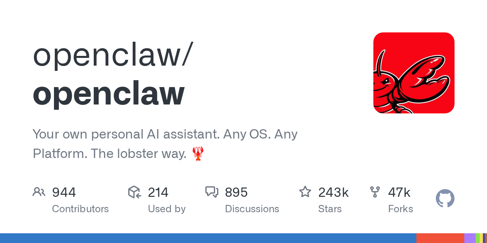
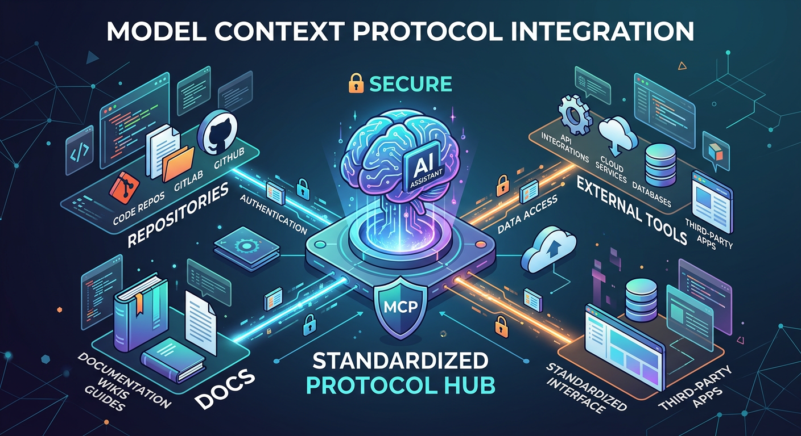

# Frontier Signal Digest — 2026-03-01

*Generated: 2026-03-01 16:19 EST*

## 1. How to Make OpenClaw 10x More Powerful
**Creator:** OpenClaw Community
**Source:** [https://www.youtube.com/watch?v=0soFIReWb1w](https://www.youtube.com/watch?v=0soFIReWb1w)

**Why it matters:**
- Showcases advanced integrations and workflows for OpenClaw.
- Directly impacts toolchain sustainability and automation capabilities.
- Essential knowledge for pushing the boundaries of what local AI agents can execute.

## 2. OpenClaw viral AI agent - Lex Fridman
**Creator:** Lex Fridman
**Source:** [https://www.youtube.com/watch?v=YFjfBk8HI5o](https://www.youtube.com/watch?v=YFjfBk8HI5o)

**Why it matters:**
- Highlights the mainstream penetration and viral nature of OpenClaw.
- Provides high-level credibility and exposure for the AI agent ecosystem.
- Shifts the conversation from niche developer tool to general-purpose computing paradigm.

## 3. OpenClaw Creator: Why 80% Of Apps Will Disappear
**Creator:** OpenClaw Creator
**Source:** [https://www.youtube.com/watch?v=4uzGDAoNOZc](https://www.youtube.com/watch?v=4uzGDAoNOZc)

**Why it matters:**
- Offers a direct strategic vision from the creator of OpenClaw on the future of software.
- Validates the vibe-coding and agent-first workflow over traditional app UIs.
- Signals a massive shift in how we should build and deploy tools moving forward.

---

## Operator Notes

- **Action 1:** Review the "10x More Powerful" workflow to see if any new toolchain integrations can be adopted immediately.
- **Action 2:** Leverage the mainstream momentum to position our own artifacts as cutting-edge agent implementations.
- **Action 3:** Shift development focus away from traditional UI building toward pure API and agent-executable scripts.
